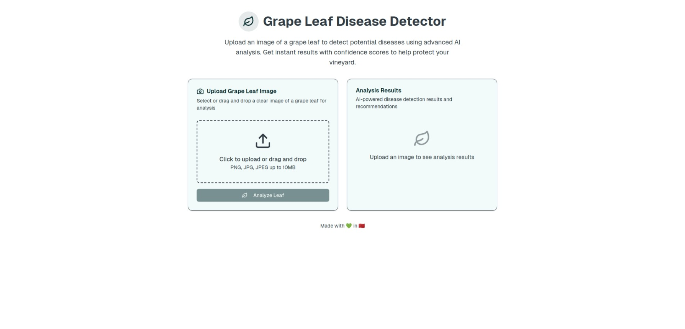
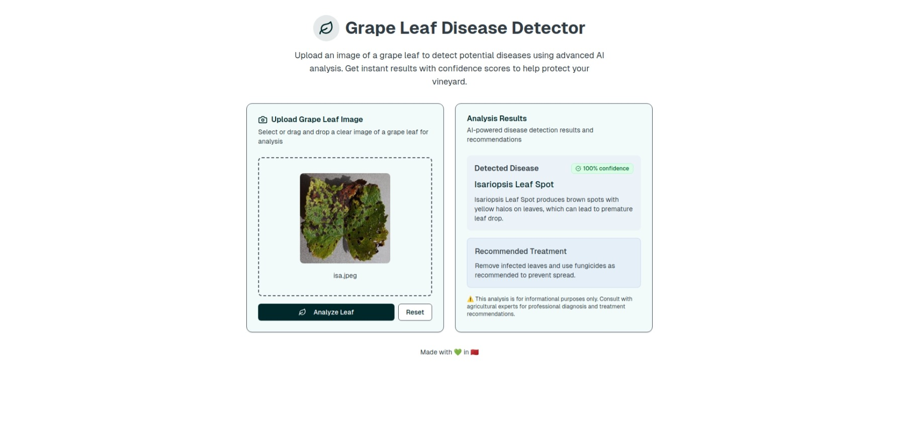

# 🍇 Grape Leaf Disease Detector

A cutting-edge AI-powered web application that identifies common grape leaf diseases using deep learning. Built with Next.js and PyTorch, this application achieves **99.7% accuracy** in detecting 3 common grape leaf diseases to help farmers and viticulturists make informed decisions about their crops.
## 🎯 What it does

This application can detect **3 common types of grape diseases**:
- **Black Rot** - A fungal disease causing dark lesions on leaves
- **Esca (Black Measles)** - A complex disease affecting the vascular system
- **Leaf Blight (Isariopsis Leaf Spot)** - Causes brown spots and leaf yellowing

## 📊 Model Performance

Our EfficientNet-B0 based model achieves exceptional performance:

- **Test Accuracy**: 99.70%
- **Total Training Epochs**: 40 (30 frozen + 10 fine-tuned)

### Training Metrics


*The model shows excellent convergence with minimal overfitting, achieving near-perfect accuracy on both training and validation sets.*

## 🖼️ Application Screenshots

### Upload Interface

*Clean and intuitive interface for uploading grape leaf images*

### Detection Results

*Detailed disease classification with confidence scores*

## 🛠️ Technology Stack

- **Frontend**: Next.js 14, React, TypeScript, Tailwind CSS
- **Backend**: Next.js API Routes
- **AI Model**: PyTorch, EfficientNet-B0, TIMM
- **Image Processing**: PIL, torchvision
- **Package Manager**: pnpm
- **Containerization**: Docker

## 🚀 Installation & Setup

### Method 1: Manual Setup

#### Prerequisites
- Node.js (v20 or higher)
- Python (v3.12 or higher)
- pnpm package manager

#### 1. Clone the Repository
```bash
git clone https://github.com/kannoun/grape-disease-detector.git
cd grape-disease-detector
```

#### 2. Install Node.js Dependencies
```bash
pnpm install
```

#### 3. Set Up Python Environment
```bash
# Create virtual environment
python -m venv grapeenv
source grapeenv/bin/activate  # On Windows: grapeenv\Scripts\activate

# Install required Python packages
pip install torch torchvision
pip install timm pillow
```

#### 4. Configure Python Path
Edit `app/api/predict/route.ts` and update the Python environment path:

```typescript
// Line 42: Update this path to your Python virtual environment
const venvPythonPath = "/path/to/your/grapeenv/bin/python";
```

#### 5. Run the Application
```bash
npm run dev
```

Visit `http://localhost:3000` to access the application.

### Method 2: Docker Setup 🐳

#### Quick Start with Docker
```bash
# Pull and run the pre-built Docker image from Docker Hub
sudo docker run -it -p 8080:8080 --name grape-disease-detector grape-disease-detector-image:v2
# OR: Pull and run the image directly from GitHub Container Registry
sudo docker run -it -p 8080:8080 --name grape-disease-detector ghcr.io/kannoun/grape-disease-detector:v2
```

Access the application at `http://localhost:8080`


## 📖 Usage

1. **Upload Image**: Click the upload area
2. **Processing**: The AI model analyzes the image using deep learning
3. **Results**: View the disease classification with confidence scores
4. **Recommendations**: Get suggestions for treatment based on the detected disease

## 🎯 Model Architecture

- **Base Model**: EfficientNet-B0 (pre-trained on ImageNet)
- **Input Size**: 256×256×3 RGB images
- **Transfer Learning**: Frozen backbone + custom classifier head
- **Fine-tuning**: Full model fine-tuning for optimal performance
- **Data Augmentation**: Rotation, flips, color jittering, and resizing

## 🔬 Training Details [Kaggle Notebook](https://www.kaggle.com/code/kannoun/grape-leaf-disease-accuracy-99)

The model was trained using a two-stage approach:

1. **Stage 1** (30 epochs): Frozen EfficientNet backbone, train only classifier
   - Learning Rate: 1e-3
   - Focus on learning disease-specific features

2. **Stage 2** (10 epochs): Full model fine-tuning
   - Learning Rate: 1e-4
   - Fine-tune all layers for optimal performance

## 🌟 Features

- ✅ **High Accuracy**: 99.7% disease detection accuracy
- 📱 **Responsive Design**: Works on desktop and mobile devices
- 🎨 **Modern UI**: Clean, intuitive interface
- 🔒 **Secure**: No image data is stored permanently
- 🌐 **Easy Deployment**: Docker support for quick setup


## 🙏 Acknowledgments

- Dataset providers for grape disease images [B. M. Shahria Alam](https://www.kaggle.com/datasets/bmshahriaalam/grape-leaf-disease)
- PyTorch and TIMM communities
- Next.js team
